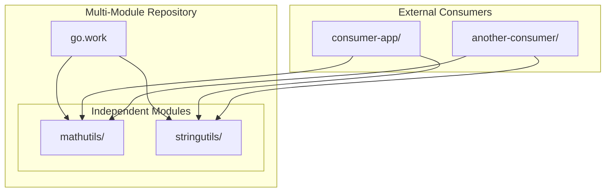

# Design Document: Go Multi-Module Repository Learning System

## Overview

This design outlines a simple Go multi-module repository learning system that demonstrates independent module versioning within a single repository. The system uses basic examples (math and string utilities) to teach core concepts without complex business logic.

The system will create two modules: `mathutils` and `stringutils` in the main repository, with external consumer applications demonstrating how breaking changes in one module don't force upgrades in others, enabling selective upgrades.

## Architecture

### High-Level Architecture



### Repository Structure

The multi-module repository will follow this structure:

```
wstest/
├── go.work                    # Workspace for local development
├── mathutils/                 # Math utilities module
│   ├── go.mod
│   ├── math.go
│   └── math_test.go
├── stringutils/               # String utilities module
│   ├── go.mod
│   ├── strings.go
│   └── strings_test.go
└── README.md                  # Learning guide and examples

# External consumers (separate repositories)
../consumer-app/               # External consumer application
├── go.mod
└── main.go

../another-consumer/           # Another external consumer
├── go.mod
└── main.go
```

## Components and Interfaces

### MathUtils Module

**Purpose**: Provides simple mathematical operations to demonstrate basic module functionality.

**Interface**:
```go
package mathutils

// Add returns the sum of two integers
func Add(a, b int) int

// Multiply returns the product of two integers  
func Multiply(a, b int) int

// Version returns the module version (for demonstration)
func Version() string
```

**Module Path**: `github.com/xwinata/wstest/mathutils`

### StringUtils Module

**Purpose**: Provides simple string operations and demonstrates breaking changes.

**Interface v1.0.0**:
```go
package stringutils

// HelloWorld returns a greeting message
func HelloWorld(name string) string

// Reverse returns the reversed string
func Reverse(s string) string

// Version returns the module version
func Version() string
```

**Interface v2.0.0 (Breaking Change)**:
```go
package stringutils

// HelloWorld returns a customizable greeting message (BREAKING CHANGE)
func HelloWorld(name, greeting string) string

// Reverse returns the reversed string
func Reverse(s string) string

// Version returns the module version
func Version() string
```

**Module Path**: `github.com/xwinata/wstest/stringutils`

### External Consumer Applications

**Purpose**: Demonstrates how external users consume the modules from separate repositories, showing real-world usage patterns.

**Consumer App Structure**:
```
consumer-app/
├── go.mod                     # Independent go.mod outside main repo
└── main.go                    # Imports specific module versions
```

**Example go.mod**:
```go
module github.com/external-user/consumer-app

go 1.21

require (
    github.com/xwinata/wstest/mathutils v1.0.1    // Bug fix version
    github.com/xwinata/wstest/stringutils v1.0.0  // Avoid v2.0.0 breaking changes
)
```

**Example main.go**:
```go
package main

import (
    "fmt"
    "github.com/xwinata/wstest/mathutils"
    "github.com/xwinata/wstest/stringutils"
)

func main() {
    // Uses mathutils v1.0.1 (with bug fix)
    result := mathutils.Add(5, 3)
    
    // Uses stringutils v1.0.0 (avoids breaking changes in v2.0.0)
    greeting := stringutils.HelloWorld("Alice")
    
    fmt.Printf("Result: %d, Greeting: %s\n", result, greeting)
}
```

## Data Models

### Module Configuration

```go
type ModuleInfo struct {
    Name        string   `json:"name"`
    Path        string   `json:"path"`
    Version     string   `json:"version"`
    Description string   `json:"description"`
    Functions   []string `json:"functions"`
}

type VersionDemo struct {
    Module      string `json:"module"`
    OldVersion  string `json:"old_version"`
    NewVersion  string `json:"new_version"`
    ChangeType  string `json:"change_type"` // "patch", "minor", "major"
    Description string `json:"description"`
}
```

### Versioning Timeline

```go
type VersionTimeline struct {
    Step        int    `json:"step"`
    Action      string `json:"action"`
    Module      string `json:"module"`
    Version     string `json:"version"`
    Description string `json:"description"`
    GitTag      string `json:"git_tag"`
}
```

## Correctness Properties

*A property is a characteristic or behavior that should hold true across all valid executions of a system-essentially, a formal statement about what the system should do. Properties serve as the bridge between human-readable specifications and machine-verifiable correctness guarantees.*

Based on the requirements analysis, here are the testable properties:

### Property 1: Multi-Module Repository Structure
*For any* multi-module repository setup, the system should create separate go.mod files for each module, use clear module names, and create a go.work file for local development.
**Validates: Requirements 1.1, 1.2, 1.3, 1.4**

### Property 2: Simple Module Functionality
*For any* module implementation, mathutils should provide basic math functions, stringutils should provide string functions, and consumer should demonstrate dependencies between modules.
**Validates: Requirements 2.1, 2.2, 2.3, 2.4**

### Property 3: Independent Versioning
*For any* module versioning operation, the system should use module-prefixed Git tags, show how changes in one module don't affect others, and demonstrate version coexistence.
**Validates: Requirements 3.1, 3.2, 3.3, 3.4**

### Property 4: Breaking Change Isolation
*For any* breaking change simulation, the system should demonstrate function signature changes, proper semantic versioning, and how consumers can avoid breaking changes.
**Validates: Requirements 4.1, 4.2, 4.3, 4.4**

### Property 5: Selective Upgrade Capability
*For any* selective upgrade scenario, the system should show how bug fixes can be adopted independently of breaking changes, solving the forced upgrade problem.
**Validates: Requirements 5.1, 5.2, 5.3, 5.4**

### Property 6: Workspace Development Experience
*For any* workspace development scenario, the go.work file should enable local development with latest versions while showing the difference from released version usage.
**Validates: Requirements 6.1, 6.2, 6.3, 6.4**

### Property 7: External Consumer Simulation
*For any* external consumer setup, the system should demonstrate proper module imports, version constraint resolution, and independent version selection.
**Validates: Requirements 7.1, 7.2, 7.3, 7.4**

## Versioning Demonstration Timeline

### Phase 1: Initial Setup
```bash
# Only mathutils and stringutils modules in main repo
git tag mathutils/v1.0.0
git tag stringutils/v1.0.0
```

### Phase 2: Bug Fix (Patch Version)
```bash
# mathutils gets a bug fix
git tag mathutils/v1.0.1
# stringutils remains at v1.0.0
```

### Phase 3: Breaking Change
```bash
# stringutils introduces breaking change
git tag stringutils/v2.0.0
# mathutils stays at v1.0.1, external consumers can choose versions
```

### Phase 4: Selective Upgrade (External Consumer)
```bash
# External consumer upgrades mathutils but stays on stringutils v1.0.0
# In consumer-app/go.mod:
# require (
#     github.com/xwinata/wstest/mathutils v1.0.1    // Get bug fix
#     github.com/xwinata/wstest/stringutils v1.0.0  // Avoid breaking changes
# )
# Demonstrates selective upgrade capability
```

## Error Handling

### Module Resolution Errors
- **Missing Modules**: Clear error when go.work references non-existent modules
- **Version Conflicts**: Descriptive errors for incompatible version constraints
- **Import Path Issues**: Helpful messages for incorrect module paths

### Breaking Change Handling
- **Compilation Errors**: Clear indication when breaking changes cause build failures
- **Version Mismatch**: Guidance on resolving version constraint conflicts
- **Migration Assistance**: Examples of how to adapt to breaking changes

### Workspace Configuration Errors
- **Invalid go.work**: Validation and correction suggestions for workspace files
- **Module Path Conflicts**: Detection and resolution of conflicting module paths
- **Dependency Cycles**: Prevention and detection of circular dependencies

## Testing Strategy

### Unit Testing
- **Function Correctness**: Test that Add(2, 3) returns 5, HelloWorld("Alice") returns "Hello, Alice!"
- **Version Information**: Verify that Version() functions return correct version strings
- **Breaking Changes**: Test that v2.0.0 functions work with new signatures
- **Error Conditions**: Test invalid inputs and edge cases

### Property-Based Testing
- **Universal Properties**: Test behaviors that should hold across all valid inputs
- **Version Consistency**: Verify that version tags match module behavior
- **Dependency Resolution**: Test that module resolution works correctly
- **Workspace Functionality**: Validate that workspace enables local development

### Integration Testing
- **Multi-Module Builds**: Test that consumer can build with different module versions
- **External Usage**: Verify that external consumers can import and use modules
- **Version Upgrades**: Test selective upgrade scenarios
- **Breaking Change Scenarios**: Validate that breaking changes are properly isolated

### Testing Configuration
- **Framework**: Use Go's built-in testing framework with testify for assertions
- **Property Testing**: Implement using gopter for property-based tests
- **Test Coverage**: Ensure comprehensive coverage of all module interactions
- **Continuous Integration**: Automated testing of all version combinations

The testing approach ensures both concrete functionality (unit tests) and universal correctness (property tests) are validated, providing confidence in the multi-module repository learning system.